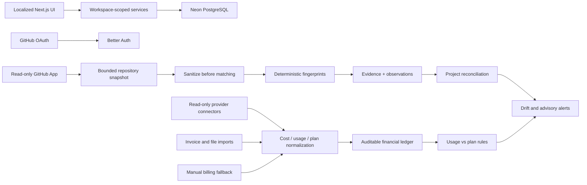

# Architecture

## Layers

- `src/app`: pages, route handlers and HTTP boundaries.
- `src/components`: presentation and small interactive controls.
- `src/server`: authentication context, domain rules, GitHub, scanner, billing and queries.
- `src/db`: Drizzle schema and runtime connection.

Server Components load data directly through server query modules. Server Actions validate inputs with Zod and authorize membership before mutations. Route Handlers are reserved for Better Auth, GitHub callbacks/webhooks and cron.

## Tenancy

Better Auth organization membership is authoritative. `workspace_profiles.organization_id` is one-to-one with an organization. Tenant tables carry `workspace_id`; services derive that ID from the authenticated session and never trust a browser-supplied workspace.

Commercial workspaces start as `pending_checkout` and remain read-only until a signed Stripe webhook reports a trialing or active subscription. The historical YoDev workspace remains `private`. GitHub and Google provide human authentication; account linking is explicit and Gmail uses a separate OAuth application and restricted scopes.

Migration `0005` enables row-level security policies on tenant business tables. The restricted `spend_app` role must execute work through `withAuthorizedWorkspace`, which sets `app.workspace_id` with transaction-local scope. The database role named exactly `spend_service` is the only role recognized by service policies; this decision is based on `current_user`, not on a caller-settable session variable. Better Auth tables and transient GitHub installation state have no `spend_app` grants and are accessed only through narrow service modules. `spend_migration` owns the schema and is never used by the runtime. Audit events intentionally have no update/delete RLS policy. The idempotent operator script `npm run db:provision-roles` creates/rotates these roles and reapplies reviewed grants after migrations.

## GitHub and scanner

Human login and repository access are separate. The installation setup URL is not trusted: Spend binds a hashed ten-minute state to the authenticated user/workspace, performs S256 PKCE GitHub App user authorization, verifies that the user token can access the candidate installation, and only then stores canonical app metadata. User and installation tokens are transient. Legacy installation rows without `verified_at` cannot list repositories, import or scan until the owner repeats this verified flow. The scanner first checks the default-branch SHA, loads only bounded candidate files, sanitizes environment files, extracts explainable evidence, and persists no source content.

## Billing and alerts

Billing accounts associate a provider with zero or more projects. Account and resource allocations are effective-dated; a change closes the previous rule and never rewrites old financial attribution. Complete allocations use deterministic largest remainders so every source cent lands on a project or the explicit unallocated bucket. Manual allocations must total exactly 10,000 basis points.

Subscriptions and costs retain original currencies and integer minor units. EUR reporting is a derived view over dated ECB reference rates: the ledger amount is never overwritten, weekends use the latest prior publication, and the UI exposes rate date/source. Alerts use partial unique indexes on open dedupe keys. Potential waste is advice only and never causes external mutation.

FinOps connectors publish a manifest containing provider, precise capabilities, authentication mode and minimum synchronization interval. Native connectors currently cover Vercel FOCUS charges/commitments, OpenAI Admin Costs by project and line item, GitHub organization billing (public preview), and AWS Cost Explorer grouped by service and an optional confirmed allocation tag. Synchronizations are idempotent and record their covered period, cursor, freshness, completeness and failure state. A failed or partial sync never means zero usage or zero cost, and a partial resource list cannot deactivate an existing resource.

Credentials are encrypted before persistence and are never returned to React or logs. Provider payloads are normalized at the boundary; raw billing payloads and unrelated customer content are not retained.

Exact provider costs may have more precision than ISO minor units. Detailed values therefore use a scaled-integer representation and are rounded to invoice minor units only at an explicit aggregation boundary.

## Scaling path

Repository scans and financial synchronization use separate bounded cron routes and idempotency domains. A future queue can invoke the unchanged scan and connector services. Evidence retention/partitioning and read replicas should only be added after measured need.

Stripe Billing is deliberately separate from the future Stripe-expense connector. `commercial_plans` and `workspace_subscriptions` model Spend itself; provider offers live in `provider_plan_versions` and `provider_plan_entitlements`.
