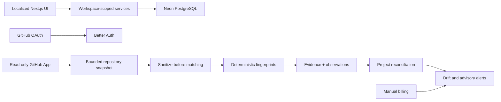

# Architecture

## Layers

- `src/app`: pages, route handlers and HTTP boundaries.
- `src/components`: presentation and small interactive controls.
- `src/server`: authentication context, domain rules, GitHub, scanner, billing and queries.
- `src/db`: Drizzle schema and runtime connection.

Server Components load data directly through server query modules. Server Actions validate inputs with Zod and authorize membership before mutations. Route Handlers are reserved for Better Auth, GitHub callbacks/webhooks and cron.

## Tenancy

Better Auth organization membership is authoritative. `workspace_profiles.organization_id` is one-to-one with an organization. Tenant tables carry `workspace_id`; services derive that ID from the authenticated session and never trust a browser-supplied workspace.

## GitHub and scanner

Human login and repository access are separate. Installation tokens are created transiently by Octokit. The scanner first checks the default-branch SHA, loads only bounded candidate files, sanitizes environment files, extracts explainable evidence, and persists no source content.

## Billing and alerts

Billing accounts associate a provider with zero or more projects. Subscriptions and costs retain original currencies and integer minor units. Alerts use partial unique indexes on open dedupe keys. Potential waste is advice only and never causes external mutation.

## Scaling path

The V1 cron processes ten repositories per invocation and exits before the function limit. A future queue can invoke the unchanged repository scan service. Evidence retention/partitioning, billing adapters and read replicas should only be added after measured need.
